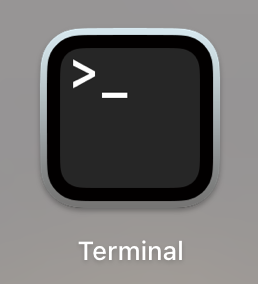

# Instructions for Version Control in GitHub

## What is version control?

When we work on our paintings and drawings we sometimes wish we could go back to a previous stage of our work. While that is nearly impossible for physical works, GitHub can help you do that with your digital work. That is the purpose of version control.

Version control can help you:
- Track every change you make
- Go back to an earlier version if something breaks
- Work with others on the same project without overwriting each other’s work

## What is GitHub?

GitHub is a platform where you can store your work (such as code, documents, images), track changes, collaborate with others, and publish your work for others to see. It works with a tool called Git—a kind of digital time machine for your projects.

Let's begin with installing GitHub.

## How to install GitHub

You need two things:
- Git: the version control tool
- GitHub account: where your work will live online

### First, create a GitHub Account

- Go to [github.com](https://github.com)
- Click Sign Up
- Follow the setup steps

### Second, install Git

!(images/unnamed.jpg)

**Mac:**

On mac, you will also be using the terminal. Click on this icon, or search and open the terminal using Spotlight.



In the terminal, type and enter
```bash
git --version
```
If Git is not installed, a pop-up will prompt you to install it.

**Windows:**
- Download Git from [git-scm.com](https://git-scm.com/download/win)
- Run the installer. Use default settings unless you know what you're doing.
- Open Git Bash to use Git commands

**Linux:**
```bash
sudo apt update
sudo apt install git
```

## How to do the basics in GitHub

### GitHub Basic Features and Usage

- Repositories: Where your projects live
- Branches: Work on different parts of a project without affecting the main version
- Commits: Save snapshots of your progress
- Pull Requests: Propose changes and discuss them before merging

### Creating a Repository

- Log into your GitHub account
- Click on the "+" icon and select "New repository"
- Name your repo, add a description, choose public or private
- Click "Create repository"

### Creating a Folder in Your Repository

- Open your repository
- Click "Add file" → "Create new file"
- In the filename box, type the folder name followed by a slash (e.g., `newfolder/`)

### Uploading Files to Your Repository

- Click "Add file" → "Upload files"
- Drag and drop or select your files
- Write a commit message and click "Commit changes"

### Writing a README

- Click "Add file" → "Create new file"
- Name it `README.md`
- Write a description of your project
- Click "Commit changes"

### Hosting a Web Page with GitHub Pages

- Go to your repository's settings
- Scroll to "GitHub Pages"
- Set Source to `main` branch, root folder
- GitHub will give you a URL to your webpage

# How to version control

### Making Commits

After making changes:
```bash
git add .
git commit -m "Your message explaining the changes"
git push origin main
```

### Working With Branches

- Commit after changes
- Create new branches for features or major changes
- Merge branches together after features are finished

Commands:
```bash
git branch branch-name
git checkout branch-name
git checkout -b branch-name
git branch
git branch -d branch-name
```

### Merging Changes

```bash
git checkout main
git merge branch-name
git push origin main
```

### Pull Requests

- Push your branch:
```bash
git push origin branch-name
```
- Open a Pull Request on GitHub:
  - Click "Compare & pull request"
  - Add title and description
  - Click "Create pull request"

### Handling Conflicts

If conflicts occur:
- Git will show sections marked with `<<<<<<<`, `=======`, and `>>>>>>>`
- Edit to resolve conflicts
- Then run:
```bash
git add filename
git commit
```

## Useful Git Commands

- Check status:
```bash
git status
```
- View history:
```bash
git log
```
- Discard local changes:
```bash
git checkout -- filename
```
- Fetch updates without merging:
```bash
git fetch
```
- Pull and merge updates:
```bash
git pull
```
- Create a release tag:
```bash
git tag v1.0.0
```

## Best Practices

- Write clear commit messages
- Commit early and often
- Create separate branches for features
- Keep branches updated
- Review code before merging
- Use a `.gitignore` to exclude unnecessary files

## Git Resources

Here are additional resources you can use for your projects. 

- [Git Documentation](https://git-scm.com/doc)
- [GitHub Guides](https://guides.github.com/)
- [Interactive Git Tutorial](https://learngitbranching.js.org/)
- [GitHub Desktop](https://desktop.github.com/)
- [Git Cheat Sheet](https://education.github.com/git-cheat-sheet-education.pdf)
